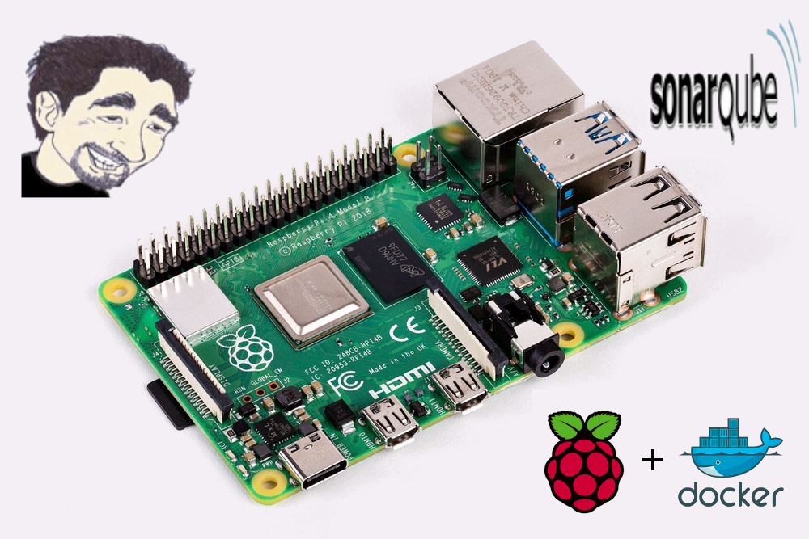

# Sonarqube

[](https://hub.docker.com/r/paperinik/rpi-sonarqube/)



This Docker container implements a Sonarqube Server.

 * balenalib/aio-3288c-ubuntu-openjdk:xenial base image.
 
### Installation from [Docker registry hub](https://registry.hub.docker.com/u/paperinik/rpi-sonarqube/).

You can download the image with the following command:

```bash
docker pull paperinik/rpi-sonarqube
```

# How to use this image

Exposed ports and volumes
----

The image exposes port `9000`. Also, exports four volumes: `/sonarqube-9.3.0.51899/data`, `/sonarqube-9.3.0.51899/temp`, `/sonarqube-9.3.0.51899/extensions` and `/sonarqube-9.3.0.51899/logs/`, used to store all data, temporary files, plugins and logs.

Use cases

Environment variables
----

1) This image uses environment variables to allow the configuration of some parameteres at run time:

* Variable name: `SONARQUBE_JDBC_USERNAME`
* Default value: sonar
* Accepted values: a valid user created in the database.
* Description: database user.

----

* Variable name: `SONARQUBE_JDBC_PASSWORD`
* Default value: xaexohquaetiesoo
* Accepted values: a valid password for the user created in the database.
* Description: database password.

----

* Variable name: `SONARQUBE_JDBC_URL`
* Default value: jdbc:postgresql://localhost:5432/sonar"
* Accepted values: jdbc database url where the container must connect.
* Description: database name.

----


2) If you'd like to run the container, you must download the plugins to a folder and pass the folder path to the container as below:

```bash
docker run -u sonarqube -d --name sonarqube \
           -v ~/projetos/dados/sonarqube/extensions:/sonarqube-9.3.0.51899/extensions \
           -v ~/projetos/dados/sonarqube/logs:/sonarqube-9.3.0.51899/logs \
           -v ~/projetos/dados/sonarqube/temp:/sonarqube-9.3.0.51899/temp \
           -v ~/projetos/dados/sonarqube/data:/sonarqube-9.3.0.51899/data \
           -e SONARQUBE_JDBC_USERNAME="USER" \
           -e SONARQUBE_JDBC_PASSWORD="PASSWORD" \
           -e SONARQUBE_JDBC_URL="jdbc:postgresql://HOST/DATABASE" \
           -p 9408:9000 \
           paperinik/rpi-sonarqube:latest

```

# Plugins:
* [GitHub Authentication Plugin](https://docs.sonarqube.org/display/PLUG/GitHub+Authentication+Plugin)
* [Git Plugin](https://docs.sonarqube.org/display/PLUG/Git+Plugin)
* [Sonar Java](https://docs.sonarqube.org/display/PLUG/SonarJava)
* [Sonar C Family for Cpp Plugin](https://www.sonarsource.com/products/codeanalyzers/sonarcfamilyforcpp.html)
* [Sonar Php Plugin](https://www.sonarsource.com/products/codeanalyzers/sonarphp.html)
* [Sonar C Sharp Plugin](https://www.sonarsource.com/products/codeanalyzers/sonarcsharp.html)
* [Sonar Pl Sql Plugin](https://www.sonarsource.com/products/codeanalyzers/sonarplsql.html)
* [Sonar TSql Plugin](https://www.sonarsource.com/products/codeanalyzers/sonartsql.html)
* [Sonar VB6 Plugin](https://www.sonarsource.com/products/codeanalyzers/sonarvb6.html)
* [Sonar VB Net Plugin](https://www.sonarsource.com/products/codeanalyzers/sonarvbnet.html)
* [Sonar Web Plugin](https://www.sonarsource.com/products/codeanalyzers/sonarweb.html)
* [Sonar Xml Plugin](https://www.sonarsource.com/products/codeanalyzers/sonarxml.html)
* [Sonar TS Plugin](https://www.sonarsource.com/products/codeanalyzers/sonarts.html)
* [Sonar CSS Plugin](https://github.com/kalidasya/sonar-css-plugin)
* [Sonar Android Plugin](https://github.com/ofields/sonar-android)
